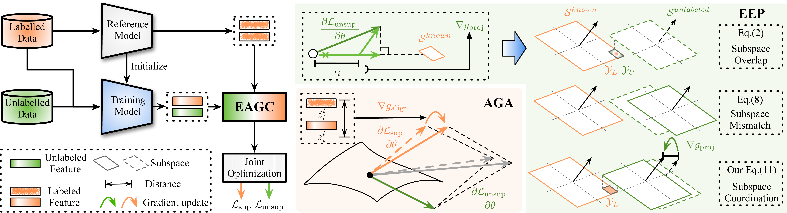

# The Devil Is in Gradient Entanglement: Energy-Aware Gradient Coordinator for Robust Generalized Category Discovery

<p align="center">
    <a href="https://example.com/paper"></a>
    <a href="https://example.com/arxiv"></a>
    <a href="https://haiyangzheng.github.io/EAGC/"></a>
</p>
<p align="center">
    The Devil Is in Gradient Entanglement: Energy-Aware Gradient Coordinator for Robust Generalized Category Discovery
</p>



Generalized Category Discovery (GCD) leverages labeled data to categorize unlabeled samples from known or unknown classes. Most previous methods jointly optimize supervised and unsupervised objectives and achieve promising results. However, inherent optimization interference still limits their ability to improve further.

In this work, we identify a key issue, namely **gradient entanglement**, which 1) distorts supervised gradients and weakens discrimination among known classes, and 2) induces representation-subspace overlap between known and novel classes, reducing the separability of novel categories. To address this issue, we propose **Energy-Aware Gradient Coordinator (EAGC)**, a plug-and-play gradient-level module for GCD. EAGC consists of two components: **Anchor-based Gradient Alignment (AGA)** and **Energy-aware Elastic Projection (EEP)**. AGA uses a reference model to anchor the gradient directions of labeled samples, while EEP softly projects unlabeled gradients away from the known-class subspace with an energy-aware scaling strategy. Extensive experiments show that EAGC consistently improves strong GCD baselines and establishes new state-of-the-art results.

## Running

### 1. Install Dependencies

```bash
pip install -r requirements.txt
```

### 2. Configure Paths

All released scripts read paths from `config1.py` by default. Fill in dataset roots, pretrained checkpoints, and the output directory before running experiments.

```python
cifar_100_root = ""
cub_root = ""
aircraft_root = ""
cars_root = ""
herbarium_dataroot = ""
imagenet_root = ""
osr_split_dir = "data/ssb_splits"
dino_pretrain_path = ""
dinov2_pretrain_path = ""
exp_root = "./outputs"
```

If you use multiple servers, you can keep additional files such as `config2.py` or `config3.py` with the same fields, and locally switch the imported config module in the shell scripts when needed.

## Datasets

We use the following benchmarks in this project:

- **CUB-200-2011**
- **Stanford Cars**
- **FGVC-Aircraft**
- **CIFAR-100**
- **ImageNet-100**
- **Herbarium19**


## Scripts

### 1. Run Released Training Scripts

The simplest way to reproduce the released setting is to run the provided shell scripts under `scripts/`.

```bash
bash scripts/SimGCD/train_cub.sh
bash scripts/LegoGCD/train_cub.sh
bash scripts/SelEx/train_cub.sh
bash scripts/SPTNet/train_cub.sh
```

Additional examples:

```bash
bash scripts/SimGCD/train_scars.sh
bash scripts/SimGCD/train_aircraft.sh
bash scripts/SimGCD/train_cifar100.sh
bash scripts/SimGCD/train_imagenet100.sh

bash scripts/SelEx/train_herb19.sh
bash scripts/SimGCD/train_herb19.sh
```

### 2. Run the Diagnose Scripts

The diagnose scripts are located in `util/Diagnose/scripts/`.

```bash
bash util/Diagnose/scripts/simgcd_cub.sh
bash util/Diagnose/scripts/eagc_simgcd_cub.sh

bash util/Diagnose/scripts/legogcd_cub.sh
bash util/Diagnose/scripts/eagc_legogcd_cub.sh

bash util/Diagnose/scripts/selex_cub.sh
bash util/Diagnose/scripts/eagc_selex_cub.sh
```

These scripts are used to measure the optimization diagnostics reported in the paper, including:

- Gradient Deviation Coefficient (GDC)
- Subspace Overlap Coefficient (SOC)

By default, the public diagnose code reports the average values over 200 training steps.

## Results

Paper values are the reported results in the paper (averaged over 3 runs). `Current GitHub` lists the current public-release runs with `seed0 / seed1 / seed2`.

### SimGCD + EAGC

| Dataset | Paper (3 runs) | Current GitHub (3 runs) |
| --- | --- | --- |
| CUB | All 66.5 / Old 71.0 / New 64.3 | seed0: All 0.6897 / Old 0.7185 / New 0.6753<br>seed1: All 0.6713 / Old 0.7458 / New 0.6340<br>seed2: All 0.6684 / Old 0.7085 / New 0.6483 |
| Stanford Cars | All 62.9 / Old 76.0 / New 56.6 | seed0: All 0.6317 / Old 0.7751 / New 0.5624<br>seed1: All 0.5993 / Old 0.7451 / New 0.5288<br>seed2: All 0.6079 / Old 0.7611 / New 0.5339 |
| Aircraft | All 57.7 / Old 60.4 / New 56.3 | seed0: All 0.5803 / Old 0.6038 / New 0.5685<br>seed1: All 0.5799 / Old 0.5744 / New 0.5826<br>seed2: All 0.5813 / Old 0.6236 / New 0.5601 |
| CIFAR-100 | All 83.1 / Old 84.1 / New 81.0 | seed0: All 0.8283 / Old 0.8313 / New 0.8222<br>seed1: All 0.8305 / Old 0.8346 / New 0.8225<br>seed2: All 0.8443 / Old 0.8327 / New 0.8677 |
| ImageNet-100 | All 83.5 / Old 93.9 / New 78.3 | seed0: All 0.8504 / Old 0.9453 / New 0.8027<br>seed1: All 0.8652 / Old 0.9457 / New 0.8248<br>seed2: All 0.8473 / Old 0.9436 / New 0.7989 |

### LegoGCD + EAGC

| Dataset | Paper (3 runs) | Current GitHub (3 runs) |
| --- | --- | --- |
| CUB | All 64.6 / Old 72.5 / New 60.7 | seed0: All 0.6710 / Old 0.7338 / New 0.6396<br>seed1: All 0.6568 / Old 0.7358 / New 0.6173<br>seed2: All 0.6733 / Old 0.7091 / New 0.6553 |
| Stanford Cars | All 62.8 / Old 76.2 / New 56.3 | seed0: All 0.6141 / Old 0.7731 / New 0.5373<br>seed1: All 0.5998 / Old 0.7676 / New 0.5187<br>seed2: All 0.6203 / Old 0.7796 / New 0.5433 |
| Aircraft | All 56.7 / Old 61.9 / New 54.0 | seed0: All 0.5685 / Old 0.6128 / New 0.5463<br>seed1: All 0.5649 / Old 0.5792 / New 0.5577<br>seed2: All 0.5681 / Old 0.5972 / New 0.5535 |
| CIFAR-100 | All 83.5 / Old 83.7 / New 83.0 | seed0: All 0.8089 / Old 0.8489 / New 0.7287<br>seed1: All 0.8391 / Old 0.8488 / New 0.8198<br>seed2: All 0.8436 / Old 0.8425 / New 0.8459 |
| ImageNet-100 | All 84.8 / Old 94.4 / New 80.1 | seed0: All 0.8597 / Old 0.9538 / New 0.8124<br>seed1: All 0.8539 / Old 0.9544 / New 0.8034<br>seed2: All 0.8606 / Old 0.9537 / New 0.8138 |

### SPTNet + EAGC

| Dataset | Paper (3 runs) | Current GitHub (3 runs) |
| --- | --- | --- |
| CUB | All 67.4 / Old 70.5 / New 66.0 | seed0: All 0.6839 / Old 0.7098 / New 0.6710<br>seed1: All 0.6713 / Old 0.7105 / New 0.6517<br>seed2: All 0.6681 / Old 0.6931 / New 0.6557 |
| Stanford Cars | All 62.1 / Old 76.1 / New 55.4 | seed0: All 0.6287 / Old 0.7776 / New 0.5568<br>seed1: All 0.5981 / Old 0.7461 / New 0.5267<br>seed2: All 0.6370 / Old 0.7581 / New 0.5786 |
| Aircraft | All 57.0 / Old 58.1 / New 56.5 | seed0: All 0.5673 / Old 0.5756 / New 0.5631<br>seed1: All 0.5613 / Old 0.5684 / New 0.5577<br>seed2: All 0.5827 / Old 0.6002 / New 0.5739 |
| CIFAR-100 | All 84.0 / Old 84.3 / New 83.5 | seed0: All 0.8348 / Old 0.8440 / New 0.8163<br>seed1: All 0.8347 / Old 0.8434 / New 0.8173<br>seed2: All 0.8517 / Old 0.8423 / New 0.8706 |
| ImageNet-100 | All 85.3 / Old 94.3 / New 80.4 | seed0: All 0.8487 / Old 0.9428 / New 0.8014<br>seed1: All 0.8628 / Old 0.9402 / New 0.8240<br>seed2: All 0.8461 / Old 0.9414 / New 0.7983 |

### SelEx + EAGC

| Dataset | Paper (3 runs) | Current GitHub (3 runs) |
| --- | --- | --- |
| CUB | All 83.2 / Old 73.9 / New 87.9 | seed0: All 0.8625 / Old 0.7705 / New 0.9086<br>seed1: All 0.8494 / Old 0.7759 / New 0.8862<br>seed2: All 0.8450 / Old 0.7185 / New 0.9082 |
| Stanford Cars | All 65.7 / Old 83.7 / New 57.0 | seed0: All 0.6621 / Old 0.8291 / New 0.5815<br>seed1: All 0.6421 / Old 0.8281 / New 0.5523<br>seed2: All 0.6730 / Old 0.8216 / New 0.6013 |
| Aircraft | All 65.7 / Old 65.6 / New 65.7 | seed0: All 0.6991 / Old 0.6711 / New 0.7130<br>seed1: All 0.6923 / Old 0.6855 / New 0.6957<br>seed2: All 0.6759 / Old 0.6489 / New 0.6894 |
| CIFAR-100 | All 79.3 / Old 84.1 / New 69.7 | seed0: All 0.7969 / Old 0.8675 / New 0.6557<br>seed1: All 0.8004 / Old 0.8694 / New 0.6624<br>seed2: All 0.7971 / Old 0.8701 / New 0.6512 |
| ImageNet-100 | All 89.8 / Old 96.2 / New 86.5 | seed0: All 0.9158 / Old 0.9713 / New 0.8879<br>seed1: All 0.9227 / Old 0.9718 / New 0.8980<br>seed2: All 0.8874 / Old 0.9569 / New 0.8524 |

### Herbarium19

| Method | Baseline | + EAGC |
| --- | --- | --- |
| SimGCD | All 44.0 / Old 58.0 / New 36.4 | All 48.4 / Old 59.8 / New 42.4 |
| SelEx | All 39.6 / Old 54.9 / New 31.3 | All 42.0 / Old 55.0 / New 35.0 |

### DINOv2 Backbone Results

| Method | Dataset | Baseline | + EAGC |
| --- | --- | --- | --- |
| SimGCD | CUB | All 71.5 / Old 78.1 / New 68.3 | All 77.9 / Old 79.9 / New 76.9 |
| SimGCD | Stanford Cars | All 71.5 / Old 81.9 / New 66.6 | All 81.5 / Old 90.9 / New 76.9 |
| SimGCD | Aircraft | All 63.9 / Old 69.9 / New 60.9 | All 74.6 / Old 74.9 / New 74.4 |
| SelEx | CUB | All 87.4 / Old 85.1 / New 88.5 | All 89.4 / Old 82.3 / New 92.9 |
| SelEx | Stanford Cars | All 82.2 / Old 93.7 / New 76.7 | All 85.3 / Old 92.7 / New 81.7 |
| SelEx | Aircraft | All 79.8 / Old 82.3 / New 78.6 | All 84.9 / Old 81.8 / New 86.5 |

### Diagnose Results

All diagnose results below are computed as the average over the first 200 training steps.

| Method | CUB | Stanford Cars | Aircraft |
| --- | --- | --- | --- |
| SimGCD | GDC 0.2669 / SOC 0.6478 | GDC 0.0909 / SOC 0.8110 | GDC 0.0935 / SOC 0.8643 |
| SimGCD + EAGC | GDC 0.1525 / SOC 0.4923 | GDC 0.0500 / SOC 0.6208 | GDC 0.0375 / SOC 0.7139 |
| LegoGCD | GDC 0.2646 / SOC 0.6468 | GDC 0.0905 / SOC 0.8112 | GDC 0.0922 / SOC 0.8642 |
| LegoGCD + EAGC | GDC 0.1594 / SOC 0.4844 | GDC 0.0515 / SOC 0.6135 | GDC 0.0376 / SOC 0.7112 |
| SelEx | GDC 0.0005 / SOC 0.5902 | GDC 0.0007 / SOC 0.6022 | GDC 0.0313 / SOC 0.6033 |
| SelEx + EAGC | GDC 0.0003 / SOC 0.4463 | GDC 0.0001 / SOC 0.4470 | GDC 0.0001 / SOC 0.5774 |

## Citing This Work

If you find this repository useful, please consider citing our work:

```bibtex
@inproceedings{zheng2026eagc,
  title={The Devil Is in Gradient Entanglement: Energy-Aware Gradient Coordinator for Robust Generalized Category Discovery},
  author={Zheng, Haiyang and Pu, Nan and Cai, Yaqi and Long, Teng and Li, Wenjing and Sebe, Nicu and Zhong, Zhun},
  booktitle={Proceedings of the IEEE/CVF Conference on Computer Vision and Pattern Recognition},
  year={2026}
}
```

## Acknowledgments

This work is built upon four strong GCD baselines. We sincerely thank the authors for their valuable contributions and open-source efforts.

- [SimGCD](https://github.com/CVMI-Lab/SimGCD)
- [SelEx](https://github.com/SarahRastegar/SelEx)
- [LegoGCD](https://github.com/Cliffia123/LegoGCD)
- [SPTNet](https://github.com/Visual-AI/SPTNet)
